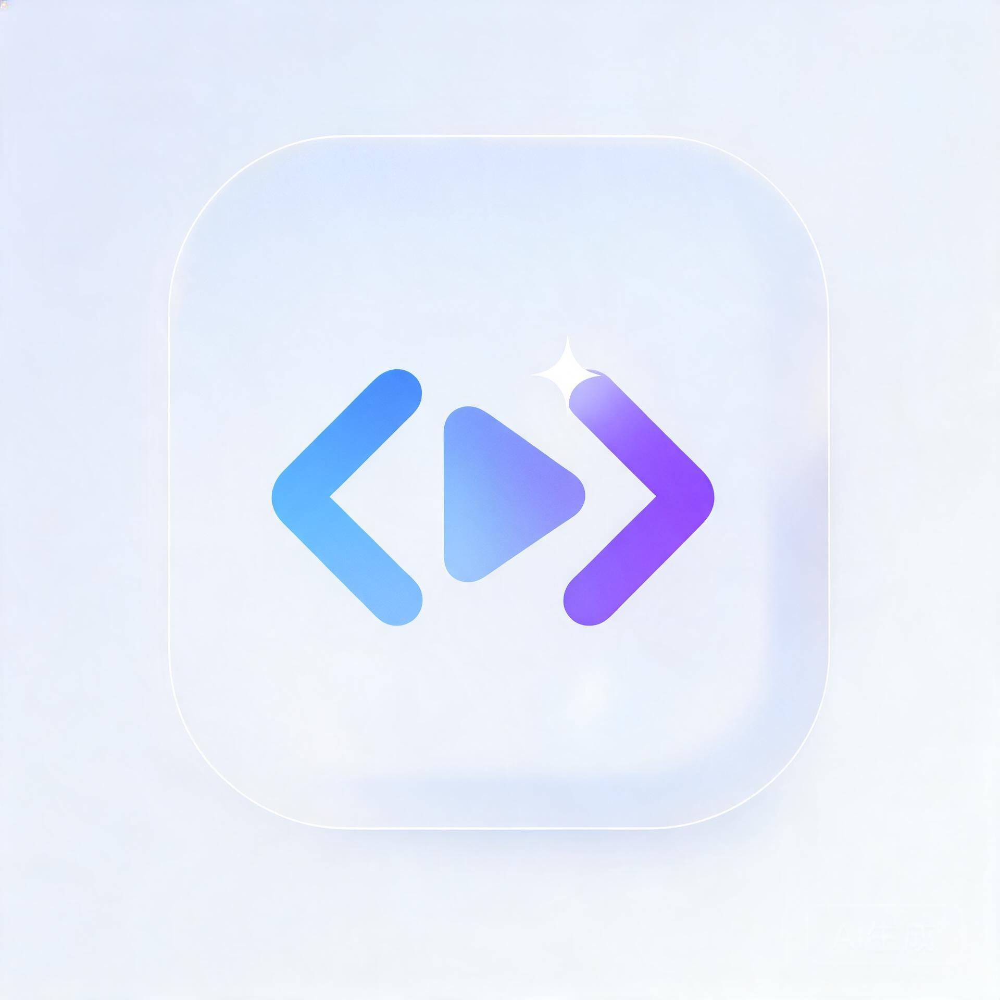

<div align="center">



# AniML

**HTML 高像素渲染 & 录制工作室**

让任意 HTML 页面在画布中自由变换，按目标分辨率精确采样，一镜到底导出 MP4。

</div>

---

## 简介

AniML 是一款以 **Flutter** 打造的移动端工具，采用 **毛玻璃（Glassmorphism）+ 白色简洁风** 的 UI。它把网页渲染与录屏能力整合到一台手机上：导入一段 HTML，在屏幕上实时预览，自由调整页面姿态与渲染尺寸，最后把渲染区内的实时像素按时序采样并合成为高清 MP4。

AniML 面向**需要把网页/动效片段变成精致视频素材**的创作者与开发者——你可以把任意 HTML 动画"渲染"成带明确分辨率的成片。

## 核心特性

- **🎨 毛玻璃 · 白色简洁 UI**
  Flutter 原生实现毛玻璃质感，白色极简风格，横屏沉浸式操作。

- **📄 导入 HTML，画布内外同时渲染**
  支持导入本地 `.html` 文件；载入后页面铺满整个画布，渲染区（带浅边框的"屏幕模拟窗口"）内外同时显示内容。

- **🔍 自由变换（搜索模式）**
  单指拖动平移、双指缩放与旋转页面视图，随性构图。

- **✏️ 可调渲染区（更改模式）**
  右侧拉取工具箱，精确调整渲染区的**长 / 宽 / 比例 / 输出像素**（支持 1080P、4K、竖屏、方形等预设）。

- **🎬 实时像素录制（拍摄模式）**
  设置拍摄时长与帧率，逐帧拉取渲染区内实时像素，最终由 FFmpeg 合成 **MP4**。

## 工作模式

屏幕左下角提供三个纯灰图标，分别对应三种模式：

| 图标 | 模式 | 功能 |
| :--- | :--- | :--- |
| 🔍 | 搜索 | 页面平移 / 缩放 / 旋转 |
| ✏️ | 更改 | 调整渲染区尺寸、比例与输出像素 |
| 🎥 | 拍摄 | 设定时长并录制像素 → 导出 MP4 |

## 技术架构

- **UI 层**：Flutter，毛玻璃主题（`BackdropFilter`），横屏锁定。
- **渲染引擎**：`webview_flutter` 承载 HTML，画布级加载与更新。
- **自由变换**：自定义 `FreeTransformRecognizer` 实现平移 / 缩放 / 旋转。
- **像素采样**：`FrameSampler` 对渲染区截图做双线性重采样，求取指定分辨率像素。
- **视频编码**：`ffmpeg_kit_flutter` 将帧序列（JPG/PNG）按帧率拼接输出 MP4。
- **状态管理**：`provider` + `ChangeNotifier` 全局控制配置与模式切换。

## 快速开始

```bash
# 安装依赖
flutter pub get

# 运行（建议横屏真机/模拟器）
flutter run
```

## 目录结构

```
lib/
├── core/          # 主题与基础样式
├── models/        # 渲染配置、分辨率/比例预设、模式枚举
├── services/      # 帧采样、自由变换手势、HTML 导入、录制引擎、视频编码
├── state/         # 全局状态控制器
└── ui/            # 主页面、导入控制与各类面板组件
assets/logo/       # 产品 LOGO
```

## 许可证

MIT License © 2026 AniML Team